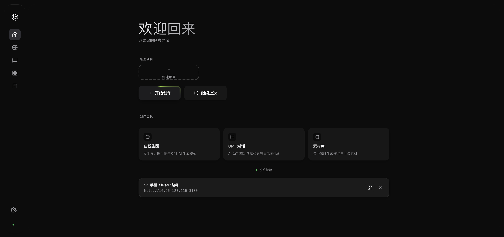
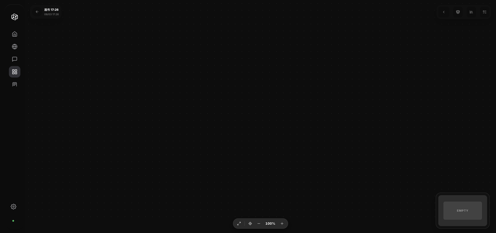
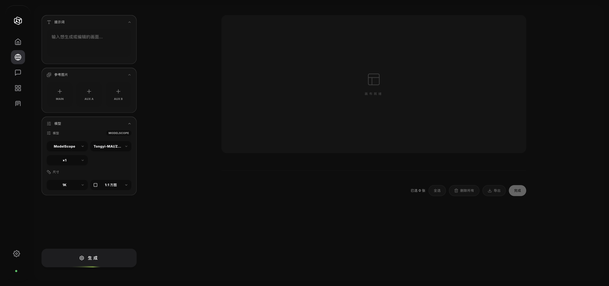
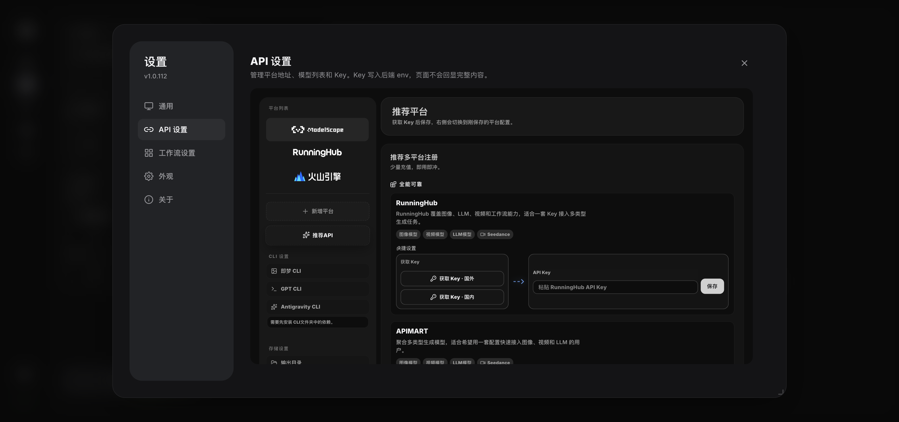
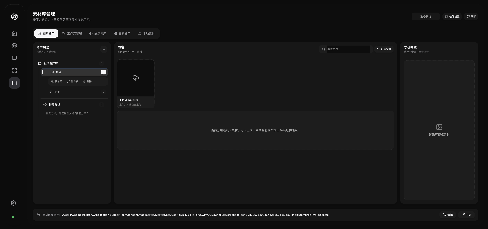

# NOVAI — 无限画布 AI 创作平台

> 自由地在无限画布上生成图像、视频，用节点串联工作流。内置 ModelScope 免费 API，开箱即用。
>
> **[English](README.en.md) · [官网](https://invaders-2.github.io/NOVAI-Infinite-Canvas/) · [帮助文档](https://invaders-2.github.io/NOVAI-Infinite-Canvas/docs.html)**

NOVAI 是一款面向创作者的全能 AI 工作台。你可以在**无限画布**上拖拽、连线、组合各种 AI 能力——文生图、图生图、AI 视频生成、GPT 多模态对话——所有操作在一个界面中无缝衔接。画布里的 **AI 助手（Agent）** 听一句话就自己规划并动手：建节点、连线、跑生成、查任务，过程实时可见、结果可整体回滚。搭配 **Photoshop 面板**和 **Chrome 扩展**，素材采集与创作流程一气呵成。











---

## 快速开始

### 下载安装（推荐）

无需安装 Python、无需配置环境，下载安装包双击即用。

#### Windows

1. 到 [Releases](https://github.com/invaders-2/NOVAI-Infinite-Canvas/releases) 下载 `NOVAI-Setup-<版本>.exe`
2. 双击安装，按引导完成（桌面快捷方式自动创建）
3. 双击桌面「NOVAI」图标启动，浏览器自动打开 `http://127.0.0.1:3000/`

#### macOS

1. 到 [Releases](https://github.com/invaders-2/NOVAI-Infinite-Canvas/releases) 下载 `NOVAI-Setup-<版本>.dmg`
2. 打开 DMG，将 `NOVAI.app` 拖入 `Applications` 文件夹
3. 双击 `NOVAI.app` 启动，浏览器自动打开 `http://127.0.0.1:3000/`

> 想要自带 Chromium 内核、支持一键自动更新的桌面客户端，用 Electron 包：Windows 是 `NOVAI-Electron-Setup-<版本>.exe`，macOS 是 `NOVAI-<版本>-arm64.dmg`。两者与上面的正式版**共用同一份数据目录**，可随时互换，详见下方「桌面客户端」。

> **首次启动提示**：macOS 可能提示「无法打开，因为它来自未识别的开发者」，请前往 **系统设置 → 隐私与安全性 → 点击「仍要打开」** 即可。

---

### 手动安装（开发者）

如果你希望从源码运行或参与开发：

```bash
# 克隆仓库
git clone https://github.com/invaders-2/NOVAI-Infinite-Canvas.git
cd NOVAI-Infinite-Canvas

# 安装依赖
pip install -r requirements.txt

# 启动服务
python main.py
```

浏览器访问 `http://127.0.0.1:3000/`

> 环境要求：Python 3.10+

---

## 常见问题

### Windows

| 问题 | 解决方法 |
|------|---------|
| **安装后打不开** | 检查防火墙是否拦截，尝试以管理员身份运行 |
| **端口 3000 被占用** | 关闭占用该端口的程序，或在启动前设置环境变量 `DEPLOY_RUN_PORT=3001` 修改端口 |
| **依赖安装失败** | 确保 Python 3.10+ 已安装且勾选了「Add Python to PATH」 |
| **杀毒软件误报** | 将 NOVAI 安装目录添加至杀毒软件信任白名单 |

### macOS

| 问题 | 解决方法 |
|------|---------|
| **「无法打开，因为它来自未识别的开发者」** | 前往 **系统设置 → 隐私与安全性** → 点击「仍要打开」 |
| **「已损坏，无法打开」** | 终端运行：`sudo xattr -rd com.apple.quarantine /Applications/NOVAI.app` |
| **端口 3000 被占用** | 终端运行 `lsof -i :3000` 查看占用进程，`kill <PID>` 结束它；或设置 `DEPLOY_RUN_PORT=3001` 修改端口 |
| **依赖问题（手动安装时）** | 确保已安装 Python 3.10+：`python3 --version`，再执行 `pip3 install -r requirements.txt` |

---

## AI 模型

内置 **ModelScope** 免费 API，开箱即用：

| 类型 | 模型 | 说明 |
|------|------|------|
| 对话 | Qwen3-235B | 通义千问旗舰，逻辑推理/写作 |
| 对话 | Qwen3-VL-235B | 多模态，可分析图片 |
| 生图 | Qwen-Image-2512 | 中文文字渲染最优，海报 Banner 首选 |
| 生图 | FLUX.2-klein-9B | 画面质感最好 |
| 生图 | Z-Image-Turbo | 1-2 秒快速出图 |
| 生图 | Qwen-Image-Edit-2511 | 说话就能改图 |
| 视频 | agnes-video-v2.0 | 免费视频生成 |

除内置免费额度外，「API 设置 → 新增平台」可以接入你自己账号的平台，模型名按平台各自维护、不会互相替换：

| 协议 | 平台 |
|------|------|
| OpenAI 兼容 | 各类中转 / 官方兼容接口（gpt-image、Nano Banana 等）；预置推荐：灵境 API、Agnes AI、EXELLOME、FHL、VIP-GPT |
| 异步协议 | APIMart |
| Gemini 原生 | Google Gemini（图像走 `/v1beta`） |
| 方舟 / Ark | 火山引擎（豆包 Seedream 生图、Seedance 视频） |
| RunningHub | OpenAPI 工作流 |
| 命令行 | 即梦 CLI、OpenAI Codex CLI、Antigravity CLI |
| 设计代理 | Lovart（Access Key / Secret Key 签名接入） |

平台下拉只显示**已配置 Key** 的供应商；没配 Key 的平台不会出现在生成节点里，也不会被当成默认平台。

---

## 特色功能

- 🧠 **智能画布 AI 助手（真 Agent）** — 一句话说清目标，模型自己多轮规划并动手：建节点、连线、跑生成、查任务；每一步实时可见，画布改动可整体回滚
- 📊 **多维表格批量生产** — 一张表驱动批量出图 / 出视频：逐行素材与提示词、逐行真实进度、随时停止，一次批量只落一个结果节点
- 🎭 **Lovart 设计代理** — 填 Access Key / Secret Key 即可接入，支持图片与视频生成、素材上传、结果回传
- 💬 **聊天式创作** — LLM 节点与 GPT 聊天支持多轮上下文、可选角色（默认「提示词优化」）、思考过程实时展示
- 🎨 **无限画布** — 自由缩放、拖拽、连线创作
- ⚡ **节点工作流** — 图像/视频/LLM 节点串联
- 🤖 **生成自动落画布** — AI 生成结果自动创建节点，无需手动导入
- 💡 **快捷建议条** — 生成完成自动弹出「换衣服 / 换场景 / 加运镜」一键继续编辑
- 🔍 **@ 引用素材** — 输入框 @ 一下即可把画布节点作为参考素材
- ✂️ **本地高质量抠图** — RMBG-2.0 按需下载，离线免费抠图 + 边缘精修，失败可降级在线
- 👤 **人脸模糊** — 一键模糊视频中全部人脸，规避平台真人审核（YuNet 检测）
- 🔌 **插件系统** — Photoshop 面板、Chrome 扩展
- 🌐 **多仓库更新** — GitHub / Gitee / ModelScope 三源
- 🇨🇳 **中文优化** — Qwen 生态深度集成

---

## 人脸合规与换脸

NOVAI 的视频编辑基于火山引擎 Seedance 2.0。平台对**未经授权的真人肖像**有严格的内容安全审核，参考素材必须走以下三条合规通道之一：

| 通道 | 适用场景 | 说明 |
|------|---------|------|
| **A · 已授权真人素材** | 换特定真人（艺人 / 模特） | 方舟体验中心 → 真人人像 → 建资产组 → 真人扫码认证 → 拿 Asset ID → `asset://` 引用 |
| **B · 信任模型产物**（推荐） | AI 脸 + AI 视频 | Seedance 视频 / Seedream 图，同账号 30 天内直接可作参考，零门槛不拦截 |
| **C · 预置虚拟人像库** | 不需要指定真人 | 平台免费虚拟人像，零合规风险 |

**拦截规则**：网上下载的含人脸视频 / 自己拍摄的真人素材 / 其他平台生成的 AI 人脸——全部拦截。解决方案：
1. **目标脸**用 Seedream 5.0 lite 生成（30 天信任期）
2. **参考视频**里的人脸先用 NOVAI「人脸模糊」处理（智能画布 → 选中视频节点 → 工具栏「人脸模糊」）

**换脸提示词模板**：

```text
严格编辑 视频1：将 视频1 中人物的面部替换为 图片1 中的人脸，
面部细节参考 图片2（特写）。动作、走位、场景、运镜、光线
全部保持不变，只修改面部。新脸与原脸型、光影自然融合，
表情跟随原动作。保持无字幕，不要生成水印。
```

> 换衣服 / 换场景 / 换人物同理：把「面部替换为图片1中的人脸」换成对应对象，保持「全部保持不变，只修改…」句式。参考素材配置：`视频1`=动作骨架 · `图片1`=目标参考 · `图片2`=细节特写（可选）。

---

## 下载与更新

安装包及更新下载地址：

| 平台 | 地址 |
|------|------|
| GitHub | https://github.com/invaders-2/NOVAI-Infinite-Canvas |
| Gitee | https://gitee.com/invaders/novai |
| ModelScope | https://modelscope.cn/studios/bllack/NOVAI |

项目启动后会自动检查三个源的最新版本，推送更新通知，一键升级。

> **Gitee 安装包说明**：Gitee 免费版附件有 100MB 单文件限制，安装包已分卷上传（`.part00`/`.part01`），下载后需先合并再安装：
> - Windows（CMD）：`copy /b NOVAI-Setup-*.exe.part00 + NOVAI-Setup-*.exe.part01 NOVAI-Setup-*.exe`
> - macOS（终端）：`cat NOVAI-Setup-*.dmg.part00 NOVAI-Setup-*.dmg.part01 > NOVAI-Setup-*.dmg`
> - 或直接到 [GitHub Releases](https://github.com/invaders-2/NOVAI-Infinite-Canvas/releases) 下载免合并的完整安装包

---

## 桌面客户端（Electron 版 · 测试）

> 新技术路线：用 **Electron** 封装，自带 Chromium 渲染内核（跨平台行为一致，不再受系统 WebView 差异影响），支持 electron-updater 自动更新。

- 源码与构建说明见 **desktop/README.md**
- 桌面端通过 pywebview 兼容桥复用既有前端（window.pywebview.api），前端零改动获得原生对话框 / 窗口控制 / 托盘能力
- **与正式版数据完全互通**：共用 3000 端口和同一份数据目录（Windows `APPDATA/NOVAI`，macOS `~/NOVAI`），画布、配置、对话记录直接共享——**无需重新下载数据，直接安装即可**；正式版正在运行时打开 Electron 版会自动复用已运行的后端，不会双开端口踩踏数据
- **自动更新三仓库通道**：GitHub Releases 为主源；国内网络检查失败时自动切换 ModelScope 镜像（`bllack/NOVAI-releases`）；Gitee Release 提供人工下载兜底。云端构建流水线（push `v*` 标签触发）会自动把安装包同步到三个仓库

---

### v1.0.122

- **修复**：Lovart 平台在老用户升级后不出现在「API 设置」的平台列表里——之前只有平台列表为空的全新安装才会带上它；现在升级后直接可见，填入 Access Key / Secret Key 保存即可用（没配密钥时不会出现在生成节点的平台下拉里）
- **改进**：自动补进来的平台不会顶掉你正在用的默认平台——没有配置密钥的平台不再被当成首选供应商

### v1.0.121

- **智能画布 AI 助手升级为「真 Agent」**：一句话指令后由模型自己多轮规划并逐步执行（新建节点、连线、跑生成、查任务），执行过程实时显示，画布改动立刻可见，跑完可整体回滚
- **新增 Lovart 设计代理供应商**：图片 / 视频生成、素材上传与结果回传，填 Access Key / Secret Key 即可接入
- **LLM 节点聊天模式**：多轮上下文、可选角色（默认「提示词优化」）、思考过程实时展示（秒表 + 呼吸动效）、输入框高度可拖动并记住
- **全局动效统一**：下拉菜单 / 选择列表改用滑块高亮（Glide），按钮带状态反馈（MorphButton），深浅色主题自适应；API 设置页与 ComfyUI 工作流设置页按统一设计语言重做
- **模型选择修复**：画布设置里手动选过的模型不再被清空或换成列表第一个，没配 Key 的供应商不再出现在下拉里；节点上换平台后残留的旧模型按该平台的历史记忆归一，并给出提示
- **多维表格 / 批量生成修复**：每行只引用本行素材、`@图片N` 按全局序号兑现、一次批量只落一个结果节点、分组互相包含不再卡死、表格与批量面板内滚轮不再误缩放画布

### v1.0.120

- **修复 Electron 桌面端后端无法启动**：桌面壳用 `--port` 传参而后端只认位置参数，后端一启动就崩（表现为「无法加载后端」）；现兼容 `--port` / 位置参数 / 环境变量，首次启动等待放宽到 3 分钟，启动失败时弹窗直接显示后端日志
- **修复更新链路**：`prompt_intelligence.py` 纳入镜像同步 / 一键更新 / 打包资源；更新兜底顺序改为国内镜像优先、滞后的源置后；Gitee 分卷同步认不出新的 Electron 安装包名
- **界面**：顶部标题区按 macOS 原生规格重做（红绿灯回到原生位置、顶栏 28px）；9 个内容页的左右内边距统一为 24px

### v1.0.119

- **更新界面改版**：「一键更新」弹窗按项目设计语言重做（浅 / 深色自适应）；检测到新版本时右下角常驻提醒，可「立即更新」或关闭忽略（同一版本不再打扰，出现更高版本会再次提醒）
- **修复**：更新弹窗里的 ModelScope 连通性检查指向早已废弃的旧地址，统一改为模型仓库 `bllack/NOVAI-releases`

### v1.0.118

- **修复 Windows 自动更新**：安装包命名与 `latest.yml` 记录不一致（下载 404 / 校验失败）——Electron 安装包改用 `NOVAI-Electron-Setup-<版本>.exe`；同时修复国内镜像同步多平台并发互相覆盖、导致部分平台更新文件缺失

### v1.0.117

- **修复桌面客户端国内在线更新**：国内兜底源此前指向魔搭创空间（只返回网页、取不到更新文件），改用魔搭模型仓库镜像，国内可正常检测与下载；macOS 未签名构建不再尝试自动安装，改为提示手动下载覆盖安装

### v1.0.116

- **灵境 API 新增视频厂商分发**：海螺 MiniMax、可灵 Kling、Vidu、通义万象、豆包 Seedance、Luma、Runway、通用统一格式，按模型名前缀自动路由
- **灵境 API 协议自动推断**：Gemini 图像模型自动走原生 `/v1beta`，其余沿用 OpenAI 兼容，不再逐个模型手配协议；拉取模型时自动补齐被令牌分组过滤掉的 Gemini 模型
- **Agnes AI 新增 Video 2.5 / 2.5 Flash** 视频模型（OpenAI Videos 兼容协议）
- **协议表**新增灵境 / Agnes 的文本、图像、视频条目，`/api/ai/descriptor` 能识别这两个平台的 video 意图
- **修复**：`gpt-image-1 / 1.5` 在部分中转无法出图（请求体带了新版官方接口已移除的 `response_format`，现不再发送，上游明确报错时自动去掉重试一次）
- **改进**：生成图片下方标注真实像素尺寸（如 `gpt-image-2 · 1254×1254`），避免把上游降采样误判成 2K / 4K
- **修复**：GPT 聊天模型选择器只显示「已配置好」的平台（平台启用 + 已填 Key + 有模型列表）；停用 ModelScope 内置默认聊天模型并从老配置里清理
- **修复**：GPT 聊天流式输出时无法上滚查看历史（现只在仍贴底时跟随最新消息）；顶栏去掉可见边框 / 色块

### v1.0.115

- **图片节点「专业调色」**：图片编辑器新增调色模式——glfx（WebGL）实时滤镜，光线／颜色／曲线／细节／效果 5 组参数 + RGB 曲线可拖点，拖拽分割线对比原图；应用后生成新图片节点，原图保留
- **分组排版重做**：按组内原图比例铺满网格（横向铺满、上下留空），拖动分组框实时重排内容；分组支持自定义名称（回车提交 / Esc 撤销）
- **分组一键运行**：传统画布「运行群组」、智能画布「一键运行」，按组内顺序级联执行
- **画布助手改版**：换成 Spectrum「AI Chat Card」形态——空状态逐字打出示例指令（点一下即接管为输入）、下沉式输入区、圆形附件/发送按钮、一键重置对话
- **连接端口重做**：白描边「加号 + 圆圈」，悬停/选中加粗放大；修复暗色主题下端口完全不可见、鼠标移上去反而消失两个问题
- **修复**：智能画布 `#world` 定位为 relative 导致的坐标换算偏移（节点跑到别处或不显示）
- **修复**：智能画布图片预览的「**对比原图**」一直不可见 —— 按钮被前置逻辑置为 `display:none` 后无人恢复，对比入口形同不存在；现由预览面板统一管理显隐（视频/360全景不显示、普通图片显示，无可对比上游则置灰）
- **修复（重要）**：**Windows 升级后历史素材不显示**——素材目录解析被「安装包自带的内置素材」误判，老用户被静默切到安装目录，数据目录里的历史图片全部 404；现改为老用户一律沿用原数据目录，并给 `/assets` 增加双目录兜底，切换前后两处的素材都能正常显示

### v1.0.114

- **历史素材修复**：修复 macOS 升级后历史图片失效——素材目录被错误解析到 app 包内只读目录；已回落真实数据目录（`~/NOVAI/assets`），历史画布与本地素材恢复正常

### v1.0.113

- **安装启动修复**：修复安装包无法启动——云端打包缺失 server 后端模块导致报 `No module named 'server'`；server 路由模块已纳入仓库并随包重新构建，素材库 / 本地素材 / 提示词库等接口恢复正常

### v1.0.112

- **前端视觉统一升级**：11 个功能页设计 token 收敛（marvis-shared/theme 样式体系），配色、间距、圆角、字体全局统一
- **GPT 聊天重构**：顶栏 / 输入框 / 空态 / 模型选择弹窗 V17-V19 重构，交互与视觉全面焕新
- **思考强度配置化**：后端能力下发，前端直读生效
- **修复**：显式尺寸选择不再被提示词关键词覆盖（gpt-image-2 分辨率稳定）；gemini 偏红误修回滚等后端修复
- **其他**：beam 灯光视觉特效、前端图标集中管理（shared/icons.js）

### v1.0.112-beta.1（测试版）

- **Electron 桌面客户端**：自带 Chromium 内核；与正式版共用 3000 端口 + 同一数据目录，数据完全互通；托盘 / 原生对话框 / 窗口控制
- **一键更新实时进度条**：下载/校验/备份/替换各阶段百分比 + 当前文件名实时可见，更新结果 Toast 轻提示
- **三仓库更新通道**：GitHub 为主，ModelScope 国内镜像自动切换，Gitee 人工下载兜底
- **桌面端侧边栏闪烁修复**：Chromium 下 hover 展开不再反复开关

### v1.0.111

- **本地高质量抠图**：图片节点新增「高质量抠图」——RMBG-2.0 本地模型按需下载（349MB，仅首次），下载后离线免费抠图；边缘精修（alpha 拉伸 + 腐蚀羽化 + 去背景色边）；本地失败可一键降级在线抠图
- **Windows 标题栏拖动修复**：无边框窗口顶部标题栏恢复可拖动移动窗口
- **旧模型自动清理**：升级后自动删除残留的 RMBG-1.4 旧模型，释放磁盘空间

### v1.0.108

- **端口修复**：恢复正式版端口 3000（误推测试版 3001 已纠正）
- **模型入库白名单**：assets/models/ 加入在线更新白名单，人脸检测模型随更新分发

### v1.0.107

- **人脸模糊工具**：选中视频节点 → 工具栏一键模糊全部人脸（YuNet 检测 + 高斯模糊），规避平台真人审核，结果自动入节点
- **视频播放交互修复**：播放 / 暂停 / 全屏 / 进度条全面修复，桌面端与浏览器行为一致（原生控制条）
- **参考素材公网化优化**：云上传（Litterbox / temp.sh）优先，不再依赖本地隧道

### v1.0.86

- **云端构建流水线**：Windows/Mac 云端打包流水线，自动构建发布
- **轮播图资源入库**：修复更新后轮播图失效问题
- **无边框窗口修复**：Win 无边框窗口拖动/边缘缩放/标题栏布局修复
- **Mac 签名优化**：dmg ad-hoc 签名防「已损坏」提示，修复签名被拷贝破坏
- **编码修复**：修复 Windows 云端构建中文编码问题

### v1.0.85

- **智能画布修复**：composer 定位、弹窗裁切、边栏偏移、标题栏布局等修复

### v1.0.84

- **画布列表增强**：卡片支持最多 4 张图片 2×2 网格预览
- **桌面端升级**：无边框窗口 + 系统托盘（关闭最小化到托盘）+ 局域网访问支持
- **桌面图标更新**：白底黑 logo 圆角设计
- **修复**：64 位 ctypes WndProc 指针截断崩溃、pystray 打包、端口占用等
- **仓库整理**：完善 .gitignore，排除设计稿/测试截图/备份文件

### v1.0.83

- **前端性能优化**：Lucide 图标子集化（体积减少 90%）、提取 NovaUtils/NovaMedia 共享模块、Marvis 风格 CSS 去重、修复定时器泄漏、页面隐藏时暂停 rAF 渲染、touch-mouse 布局缓存优化
- **模型选择弹窗重构**：左右两栏布局，悬停联动切换供应商，动态高度自适应屏幕空间
- **修复 GPT 聊天功能**：修复 TDZ 错误导致模型选择弹窗空白、无法选择供应商和模型
- **修复图标与提示问题**：修复多个页面 Lucide 图标不显示，修复素材库状态栏泄露英文错误信息
- **统一设置页面风格**：API 设置与工作流设置页面设计同步为 Marvis 风格，修复 CSS 语法错误
- **新增后端工具 API**：7 个 API 端点（存储管理、图片检测、分类 Prompt、模型规范化、RunningHub 钱包状态）
- **修复竞态问题**：sendChatMessage 防重入、setTimeout 递归轮询、node.running 过早清零

